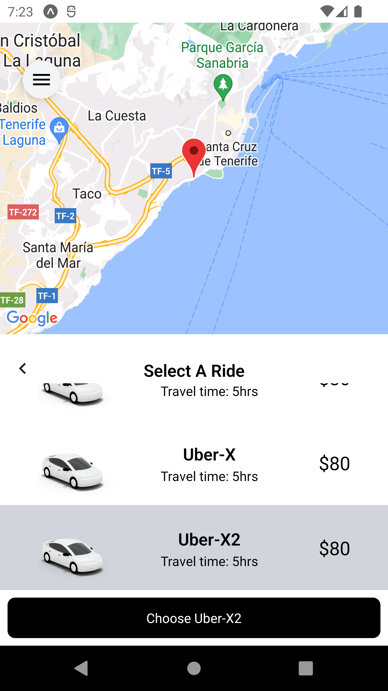

# Indie-Uber 🚗

Indie-Uber is a ride-sharing app that lets you book rides on-demand, just like Uber. The app is built using React Native and is a clone of the popular ride-hailing service.

## Screenshots 📱

Here are some screenshots of the Indie-Uber app in action:

  
  
  

## Features 🚀

- Book rides on-demand
- Set select different locations
- Check the route on the map

## Getting Started 🛠️

To get started with Indie-Uber, follow these steps:

1. Clone this repository to your local machine.
2. Run `npm install` to install all the required dependencies.
3. Run `npm start` to start the development server.
4. Use the Expo app to preview the app on your mobile device or emulator.

## Contributing 🤝

If you'd like to contribute to the project, please follow these steps:

1. Fork this repository.
2. Create a new branch.
3. Make your changes and commit them.
4. Push your changes to your fork.
5. Create a pull request.

## License 📜

This project is licensed under the MIT License.
